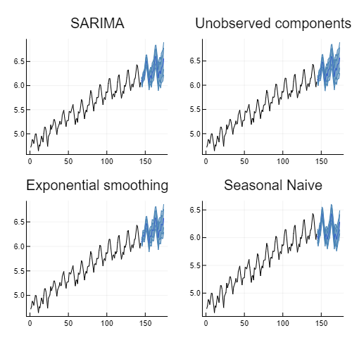

[build-img]: https://github.com/LAMPSPUC/StateSpaceModels.jl/workflows/CI/badge.svg?branch=master
[build-url]: https://github.com/LAMPSPUC/StateSpaceModels.jl/actions?query=workflow%3ACI

[codecov-img]: https://codecov.io/gh/LAMPSPUC/StateSpaceModels.jl/coverage.svg?branch=master
[codecov-url]: https://codecov.io/gh/LAMPSPUC/StateSpaceModels.jl?branch=master

# StateSpaceModels.jl

| **Build Status** | **Coverage** | **Documentation** |
|:-----------------:|:-----------------:|:-----------------:|
| [![Build Status][build-img]][build-url] | [![Codecov branch][codecov-img]][codecov-url] |[](https://lampspuc.github.io/StateSpaceModels.jl/latest/)

StateSpaceModels.jl is a package for modeling, forecasting, and simulating time series in a state-space framework. Implementations were made based on the book "Time Series Analysis by State Space Methods" (2012) by James Durbin and Siem Jan Koopman. The notation of the variables in the code also follows the book.

## Quickstart
```julia
import Pkg

Pkg.add("StateSpaceModels")

using StateSpaceModels

y = randn(100)

model = LocalLevel(y)

fit!(model)

results(model)

forecast(model, 10)

kf = kalman_filter(model)

v = get_innovations(kf)

ks = kalman_smoother(model)

alpha = get_smoothed_state(ks)
```

## Features

Current features include:
* Kalman filter and smoother
* Maximum likelihood estimation
* Forecasting and Monte Carlo simulation
* User-defined models (user specifies the state-space system)
* Several predefined models, including:
  * Exponential Smoothing (ETS, all the linear ones)
  * Unobserved components (local level, basic structural, ...)
  * SARIMA
  * Linear regression
  * Naive models
* Completion of missing values
* Diagnostics for the residuals of fitted models
* Visualization recipes

## Quick Examples

### Fitting and forecasting
Quick example of different models fit and forecast for the air passengers time-series

```julia
using CSV
using DataFrames
using Plots
using StateSpaceModels

airp = CSV.File(StateSpaceModels.AIR_PASSENGERS) |> DataFrame
log_air_passengers = log.(airp.passengers)
steps_ahead = 30

# SARIMA
model_sarima = SARIMA(log_air_passengers; order = (0, 1, 1), seasonal_order = (0, 1, 1, 12))
fit!(model_sarima)
forec_sarima = forecast(model_sarima, steps_ahead)

# Unobserved Components
model_uc = UnobservedComponents(log_air_passengers; trend = "local linear trend", seasonal = "stochastic 12")
fit!(model_uc)
forec_uc = forecast(model_uc, steps_ahead)

# Exponential Smoothing
model_ets = ExponentialSmoothing(log_air_passengers; trend = true, seasonal = 12)
fit!(model_ets)
forec_ets = forecast(model_ets, steps_ahead)

# Naive model
model_naive = SeasonalNaive(log_air_passengers, 12)
fit!(model_naive)
forec_naive = forecast(model_naive, steps_ahead)

plt_sarima = plot(model_sarima, forec_sarima; title = "SARIMA", label = "");
plt_uc = plot(model_uc, forec_uc; title = "Unobserved components", label = "");
plt_ets = plot(model_ets, forec_ets; title = "Exponential smoothing", label = "");
plt_naive = plot(model_ets, forec_naive; title = "Seasonal Naive", label = "");

plot(plt_sarima, plt_uc, plt_ets, plt_naive; layout = (2, 2), size = (500, 500))
```


### Automatic forecasting
Quick examples on automatic forecasting. When performing automatic forecasting 
users should provide the seasonal period if there is one.
```julia
model = auto_ets(log_air_passengers; seasonal = 12)
```

## Contributing

* PRs such as adding new models and fixing bugs are very welcome!
* For nontrivial changes, you'll probably want to first discuss the changes via issue.

## Citing StateSpaceModels.jl

If you use StateSpaceModels.jl in your work, we kindly ask you to cite the [following paper](https://arxiv.org/abs/1908.01757):

    @article{SaavedraBodinSouto2019,
      title={StateSpaceModels.jl: a Julia Package for Time-Series Analysis in a State-Space Framework},
      author={Raphael Saavedra and Guilherme Bodin and Mario Souto},
      journal={arXiv preprint arXiv:1908.01757},
      year={2019}
    }
