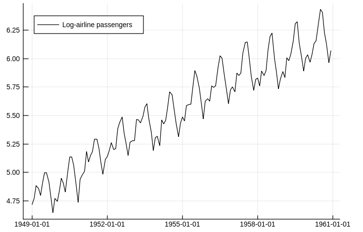

# Examples

## Air Passengers

Let's take the Air Passenger time series to build and example. In order to avoid multiplicative effects, we use the well-known approach of taking the log of the series. The code is in the example folder.

```julia
using CSV, StateSpaceModels, Plots, Statistics, Dates

#load the AirPassengers dataset
AP = CSV.read("AirPassengers.csv")

#Take the log of the series
logAP = log.(Array{Float64}(AP[:Passengers]))

p1 = plot(AP[:Date], logAP, label = "AirPassengers timeseries", size = (1000, 500))
```



Estimating a `StateSpaceModel` gives us the trend and seasonal components of the time series.

```julia
#Define its seasonality 
s = 12

#Estimate a StateSpace Structure
ss = statespace(logAP, s)

#Analyze its decomposition in seasonal and trend
p2 = plot(AP[:Date], ss.state.seasonal, label = "AirPassengers seasonal", size = (1000, 500))
p3 = plot(AP[:Date], ss.state.trend, label = "AirPassengers trend", size = (1000, 500))
```


We can also generate future scenarios for this time series through Monte Carlo simulation. In this example, we simulate 100 scenarios for up to five years (60 time periods) ahead.

```julia
#Simulate 100 scenarios, 60 steps ahead
num_scenarios = 100
num_steps_ahead = 60
simulation = simulate(ss, num_steps_ahead, num_scenarios)

#Define simulation dates
firstdate = AP[:Date][end] + Month(1)
newdates = collect(firstdate:Month(1):firstdate + Month(num_steps_ahead - 1))

#Evaluating the mean of the forecast and its quantiles
simulation_mean = mean(simulation, dims = 3)[1, :, :]

n = length(logAP)
nmonths = length(simulation[1, :, 1])
simulation_q05 = zeros(nmonths)
simulation_q95 = zeros(nmonths)
for t = 1:nmonths
    simulation_q05[t] = quantile(simulation[1, t, :], 0.05)
    simulation_q95[t] = quantile(simulation[1, t, :], 0.95)
end

plot!(p1, newdates, [simulation_q05, simulation_mean, simulation_q95], labels = ["5% quantile", "mean", "95% quantile"])
```


## Vehicle tracking

In order to illustrate one application that does not fall into any of the predefined models, thus requiring a user-defined model, let us consider an example from control theory. More precisely, we are going to use StateSpaceModels.jl to track a vehicle from noisy sensor data. In this case, ``y_t`` is a ``2 \times 1`` observation vector representing the corrupted measurements of the vehicle's position on the two-dimensional plane in instant ``t``. Since sensors collect the observations with the presence of additive Gaussian noise, we need to filter the observation in order to obtain a better estimate of the vehicle's position.

The position and speed in each dimension compose the state of the vehicle. Let us refer to ``x_t^{(d)}`` as the position on the axis ``d`` and to ``\dot{x}^{(d)}_t`` as the speed on the axis ``d`` in instant ``t``. Additionally, let ``\eta^{(d)}_t`` be the input drive force on the axis ``d``, which acts as state noise. For a single dimension, we can describe the vehicle dynamics as
```math
\begin{align}
    x_{t+1}^{(d)} &= x_t^{(d)} + \Big( 1 - \frac{\rho \Delta_t}{2} \Big) \Delta_t \dot{x}^{(d)}_t + \frac{\Delta^2_t}{2} \eta_t^{(d)}, \\
    \dot{x}^{(d)}_{t+1} &= (1 - \rho) \dot{x}^{(d)}_{t} + \Delta_t \eta^{(d)}_t,
\end{align}
```
where ``\Delta_t`` is the time step and ``\rho`` is a known damping effect on speed. 

We can cast this dynamical system as a state-space model in the following manner:
```math
\begin{align} 
    y_t &= \begin{bmatrix} 1 & 0 & 0 & 0 \\ 0 & 0 & 1 & 0 \end{bmatrix} \alpha_{t+1} + \varepsilon_t, \\
    \alpha_{t+1} &= \begin{bmatrix} 1 & (1 - \tfrac{\rho \Delta_t}{2}) \Delta_t & 0 & 0 \\ 0 & (1 - \rho) & 0 & 0 \\ 0 & 0 & 1 & (1 - \tfrac{\rho \Delta_t}{2}) \\ 0 & 0 & 0 & (1 - \rho) \end{bmatrix} \alpha_{t} + \begin{bmatrix} \tfrac{\Delta^2_t}{2} & 0 \\ \Delta_t & 0 \\ 0 & \tfrac{\Delta^2_t}{2} \\ 0 & \Delta_t \end{bmatrix} \eta_{t},
\end{align}
```
where ``\alpha_t = (x_t^{(1)}, \dot{x}^{(1)}_{t}, x_t^{(2)}, \dot{x}^{(2)}_{t})^{\top}`` and ``\eta_t = (\eta^{(1)}_t, \eta^{(2)}_t)^{\top}``.

We can formulate the vehicle tracking problem in StateSpaceModels.jl as:
```julia
# State transition matrix
T = kron(Matrix{Float64}(I, p, p), [1 (1 - ρ * Δ / 2) * Δ; 0 (1 - ρ * Δ)])
# Input matrix
R = kron(Matrix{Float64}(I, p, p), [.5 * Δ^2; Δ])
# Output (measurement) matrix
Z = kron(Matrix{Float64}(I, p, p), [1 0])
# User defined model
model = StateSpaceModel(y, Z, T, R)
# Estimate vehicle speed and position
ss = statespace(model)
```

In this example, we define the noise variances ``H`` and ``Q``, generate the noises and simulate a random vehicle trajectory using the state-space equations:
```julia
# Generate random actuators
Q = .5 * Matrix{Float64}(I, q, q)
η = MvNormal(zeros(q), Q)
# Generate random measurement noise
H = 2. * Matrix{Float64}(I, p, p)
ε = MvNormal(zeros(p), H)
# Simulate vehicle trajectory
α = zeros(n + 1, m)
y = zeros(n, p)
for t in 1:n
    y[t, :] = Z * α[t, :] + rand(ε)
    α[t + 1, :] = T * α[t, :] + R * rand(η)  
end
```

An illustration of the results can be seen in the following figure. It can be seen that the measurements are reasonably noisy when compared to the true position. Furthermore, the estimated positions, represented by the smoothed state, effectively estimate the true positions with small inaccuracies.

