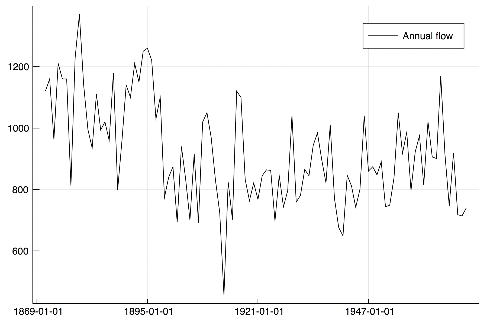
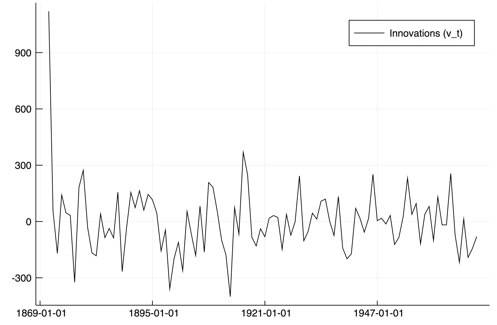
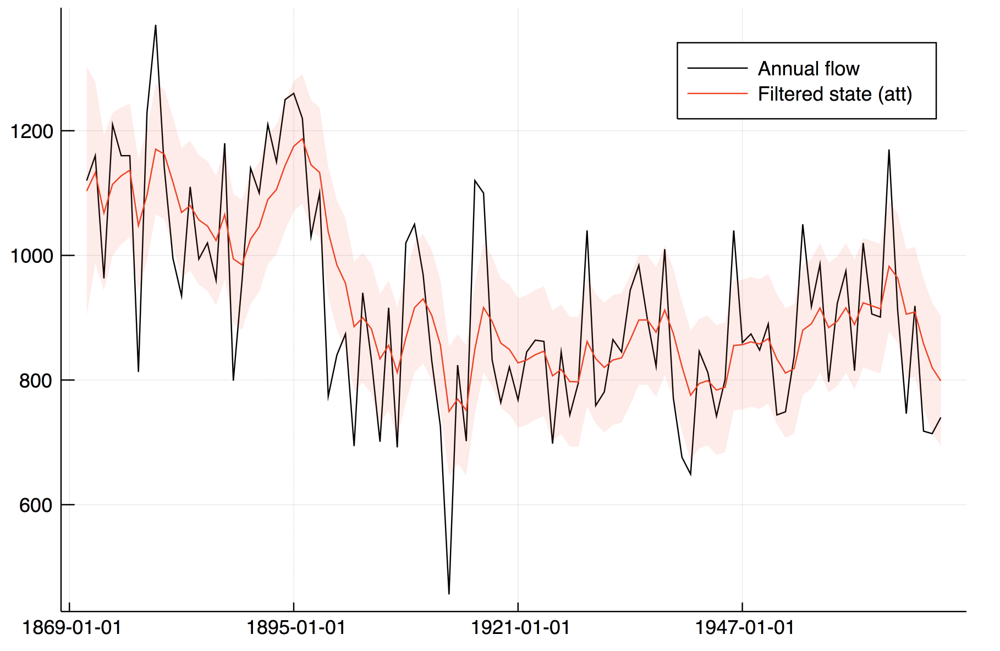
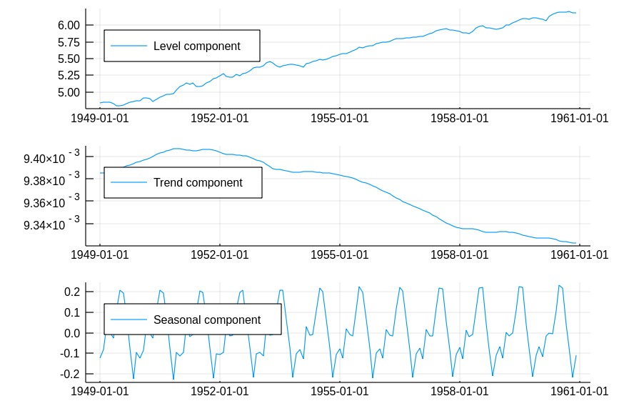
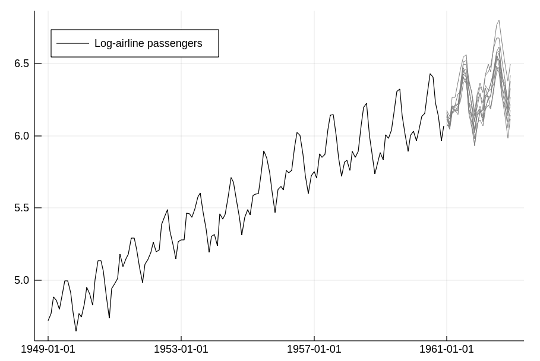
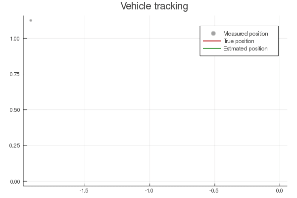

# Examples

## Nile river annual flow

As the first example let us study the annual flow of the Nile river using a local level model [`local_level`](@ref).

```julia
using CSV, StateSpaceModels, Plots, Dates

# Load the Nile annual flow dataset
nile = CSV.read("Nile.csv")

# Convert data to an array of Float64
flow = Float64.(nile.Flow)

# Plot the data
p1 = plot(nile.Year, flow, label = "Annual flow", legend = :topright, color = :black)
```


Estimate the local level model and plot the innovations
```julia
# Specify the state-space model
model = local_level(flow)

# Estimate the state-space model
ss = statespace(model)

# Innovations
p2 = plot(nile.Year, ss.filter.v, label = "Innovations (v_t)", legend = :topright, color = :black)
```


Plot the filtered state and its confidence interval 
```julia
# Plot filtered state and 90% confidence interval
std_ptt = sqrt.(ss.filter.Ptt[1, 1, :])
att = vec(ss.filter.att)
lb = vec(att + 1.64 * std_ptt)
ub = vec(att - 1.64 * std_ptt)
p3 = plot!(p1, nile.Year, att, ribbon = [ub - att, lb + att], 
           label = "Filtered state (att)", color = :red, fillalpha = 0.1)
```


## Air Passengers

Let's take the classical Air Passenger time series as an example. In order to avoid multiplicative effects, we use the well-known approach of taking the log of the series. The code is in the example folder.

```julia
using CSV, StateSpaceModels, Plots, Statistics, Dates

# Load the AirPassengers dataset
AP = CSV.read("AirPassengers.csv")

# Take the log of the series
logAP = log.(Vector{Float64}(AP.Passengers))

# Plot the data
p1 = plot(AP.Date, logAP, label = "Log-airline passengers", legend = :topleft, color = :black)
```


First we need to specify a state-space model. In this case, we'll utilize the basic structural model.

```julia
# Create structural model with seasonality of 12 months
model = structural(logAP, 12)
```

Estimating the model gives us the trend and seasonal components of the time series.

```julia
ss = statespace(model)

# Analyze its decomposition in trend, slope and seasonal components
p2 = plot(AP.Date, [ss.smoother.alpha[:, 1] ss.smoother.alpha[:, 2] ss.smoother.alpha[:, 3]], layout = (3, 1),
            label = ["Trend" "Slope" "Seasonal"], legend = :topleft)
```



We can forecast this time series. In this example we will forecast 24 months ahead.

```julia
N = 24
pred, dist = forecast(ss, N)

# Define forecasting dates
firstdate = AP.Date[end] + Month(1)
newdates = collect(firstdate:Month(1):firstdate + Month(N - 1))

p3 = plot!(p1, newdates, pred, label = "Forecast")
```


Another feature of StateSpaceModels.jl is to simulate scenarios of the time series. In this example
we will simulate 10 scenarios for 24 months ahead.

```julia
sim = simulate(ss, N, 10)
p4 = plot!(p1, newdates, sim[:, 1, :], label = "", color = "Grey", width = 0.2)
```



## Vehicle tracking

In order to illustrate one application that does not fall into any of the predefined models, thus requiring a user-defined model, let us consider an example from control theory. More precisely, we are going to use StateSpaceModels.jl to track a vehicle from noisy sensor data. In this case, ``y_t`` is a ``2 \times 1`` observation vector representing the corrupted measurements of the vehicle's position on the two-dimensional plane in instant ``t``. Since sensors collect the observations with the presence of additive Gaussian noise, we need to filter the observation in order to obtain a better estimate of the vehicle's position. The full code to run this example is in the example folder.

The position and speed in each dimension compose the state of the vehicle. Let us refer to ``x_t^{(d)}`` as the position on the axis ``d`` and to ``\dot{x}^{(d)}_t`` as the speed on the axis ``d`` in instant ``t``. Additionally, let ``\eta^{(d)}_t`` be the input drive force on the axis ``d``, which acts as state noise. For a single dimension, we can describe the vehicle dynamics as
```math
\begin{align}
    x_{t+1}^{(d)} &= x_t^{(d)} + \Big( 1 - \frac{\rho \Delta_t}{2} \Big) \Delta_t \dot{x}^{(d)}_t + \frac{\Delta^2_t}{2} \eta_t^{(d)}, \\
    \dot{x}^{(d)}_{t+1} &= (1 - \rho) \dot{x}^{(d)}_{t} + \Delta_t \eta^{(d)}_t,
\end{align}
```
where ``\Delta_t`` is the time step and ``\rho`` is a known damping effect on speed. 

We can cast this dynamical system as a state-space model in the following manner:
```math
\begin{align} 
    y_t &= \begin{bmatrix} 1 & 0 & 0 & 0 \\ 0 & 0 & 1 & 0 \end{bmatrix} \alpha_{t+1} + \varepsilon_t, \\
    \alpha_{t+1} &= \begin{bmatrix} 1 & (1 - \tfrac{\rho \Delta_t}{2}) \Delta_t & 0 & 0 \\ 0 & (1 - \rho) & 0 & 0 \\ 0 & 0 & 1 & (1 - \tfrac{\rho \Delta_t}{2}) \\ 0 & 0 & 0 & (1 - \rho) \end{bmatrix} \alpha_{t} + \begin{bmatrix} \tfrac{\Delta^2_t}{2} & 0 \\ \Delta_t & 0 \\ 0 & \tfrac{\Delta^2_t}{2} \\ 0 & \Delta_t \end{bmatrix} \eta_{t},
\end{align}
```
where ``\alpha_t = (x_t^{(1)}, \dot{x}^{(1)}_{t}, x_t^{(2)}, \dot{x}^{(2)}_{t})^{\top}`` and ``\eta_t = (\eta^{(1)}_t, \eta^{(2)}_t)^{\top}``.

We can formulate the vehicle tracking problem in StateSpaceModels.jl as:
```julia
using StateSpaceModels, Distributions, LinearAlgebra, Plots, Random

# Fix seed
Random.seed!(1)

# Number of observations
n = 400
# State dimension (2d position + 2d speed)
m = 4
# Measurements dimension (2d noisy position)
p = 2
# Control dimension (2d acceleration)
q = 2

# Damping ratio
ρ = 0.05
# Time delta
Δ = 1.0

# State transition matrix
T = kron(Matrix{Float64}(I, p, p), [1.0 (1.0 - ρ * Δ / 2.0) * Δ; 0.0 (1.0 - ρ * Δ)])
# Input matrix
R = kron(Matrix{Float64}(I, p, p), [0.5 * Δ^2; Δ])
# Output (measurement) matrix
Z = kron(Matrix{Float64}(I, p, p), [1.0 0.0])
```

In this example, we define the noise variances ``H`` and ``Q``, generate the noises and simulate a random vehicle trajectory using the state-space equations:
```julia
# Generate random actuators
Q = 0.5 * Matrix{Float64}(I, q, q)
η = MvNormal(Q)

# Generate random measurement noise
H = 2.0 * Matrix{Float64}(I, p, p)
ε = MvNormal(H)

# Simulate vehicle trajectory
α = zeros(n + 1, m)
y = zeros(n, p)
for t in 1:n
    y[t, :] = Z * α[t, :] + rand(ε)
    α[t + 1, :] = T * α[t, :] + R * rand(η)  
end
α = α[1:n, :]

# User defined model
model = StateSpaceModel(y, Z, T, R)
# Estimate vehicle speed and position
ss = statespace(model)

# StateSpaceModels.jl correctly estimated the parameters H and Q
ss.model.H
ss.model.Q
```

An illustration of the results can be seen in the following figure. It can be seen that the measurements are reasonably noisy when compared to the true position. Furthermore, the estimated positions, represented by the filtered state, effectively estimate the true positions with small inaccuracies.

```julia
anim = @animate for i in 1:n
    plot(y[1:i, 1], y[1:i, 2], label="Measured position", line=:scatter, lw=2, markeralpha=0.2, color=:black, title="Vehicle tracking")
    plot!(α[1:i, 1], α[1:i, 3], label="True position", lw=3, color=:indianred)
    plot!(ss.filter.a[2:i+1, 1], ss.filter.a[2:i+1, 3], label="Estimated position", lw=2, color=:forestgreen)
end

gif(anim, "vehicle_tracking.gif", fps = 15)
```


